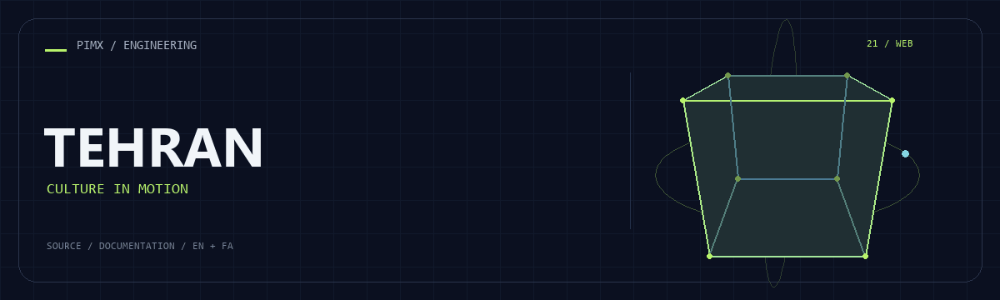

<div align="center">



**[English](README.md) · [فارسی](README.fa.md)**

</div>

# 🏙️ TEHRAN

<!-- pimx-live-site:start -->
## Live website

**[Open Tehran ↗](https://iamtehran.pages.dev/)**
<!-- pimx-live-site:end -->

A static cultural/media website with multiple editorial pages, embedded video content and a dark visual theme.

[GitHub](https://github.com/MOHAMMADREZAABEDINPOOR/Tehran) · [PIMX / Profile](https://github.com/MOHAMMADREZAABEDINPOOR) · [Static artwork](assets/readme/hero.png)

| At a glance | Details |
|:---|:---|
| 🏙️ Experience | Web application / browser experience |
| 🧰 Built with | `HTML / CSS / JavaScript` |
| 🌐 Documentation | [English](README.md) · [فارسی](README.fa.md) |

[✨ Features](#features) · [🚀 Getting started](#getting-started) · [⚙️ Configuration](#configuration) · [🌍 Deployment](#deployment)

---

<a id="features"></a>

## ✨ Features

| Area | Included capability |
|:---|:---|
| ⚡ Workflow | Home, press, comedy, events and contact pages |
| ⚡ Workflow | Video embeds and video-configuration notes |
| ⚡ Workflow | Separate page styles and a shared script |
| ⚡ Workflow | Responsive HTML/CSS presentation |

<a id="stack"></a>

## 🧰 Stack

| Tool | Version / source |
|---|---|
| HTML / CSS / JavaScript | `static files` |

<a id="getting-started"></a>

## 🚀 Getting started

A modern browser; Python is optional for the local HTTP server.

```bash
git clone https://github.com/MOHAMMADREZAABEDINPOOR/Tehran.git
cd Tehran

python -m http.server 8000
```

<a id="configuration"></a>

## ⚙️ Configuration

No standard environment template is defined. Standalone exercises need no external configuration; inspect any service constants or paths in the source before running.

<a id="usage"></a>

## 🎯 Usage

Open index.html through HTTP, then explore editorial pages. Update embedded-video identifiers using the included video notes.

<a id="project-structure"></a>

## 🗂️ Project structure

| Path | Role |
|---|---|
| [`assets/`](assets/) | Brand/media/README assets |
| [`about.html`](about.html) | Project entry/configuration file |
| [`comedy.html`](comedy.html) | Project entry/configuration file |
| [`contact.html`](contact.html) | Project entry/configuration file |
| [`events.html`](events.html) | Project entry/configuration file |
| [`index.html`](index.html) | Project entry/configuration file |
| [`press-detail-2.html`](press-detail-2.html) | Project entry/configuration file |
| [`press-detail-3.html`](press-detail-3.html) | Project entry/configuration file |
| [`press-detail-4.html`](press-detail-4.html) | Project entry/configuration file |
| [`press-detail.html`](press-detail.html) | Project entry/configuration file |
| [`press.html`](press.html) | Project entry/configuration file |
| [`shop.html`](shop.html) | Project entry/configuration file |

<a id="commands-and-checks"></a>

## 🧪 Commands and checks

No automated test command is declared in a manifest. Verify behavior through a local example run.

<a id="deployment"></a>

## 🌍 Deployment

Publish the directory to an HTTPS static host and verify file paths and external links.

<a id="limitations"></a>

## 📌 Limitations

Embedded media requires network access and depends on the hosting provider. Shop/contact pages in a static snapshot do not imply a checkout or messaging backend.

<a id="troubleshooting"></a>

## 🛠️ Troubleshooting

- Missing packages: install dependencies using the project’s package manager.
- API/network failure: check the configured origin, provider and hosting bindings.
- Old assets: rebuild when a build script exists, then clear the browser cache.

<a id="contributing"></a>

## 🤝 Contributing

Create a focused branch, verify the affected behavior and explain the change clearly. Keep private data, build outputs and local databases out of commits.

<a id="license"></a>

## 📄 License

No repository-level license file is included in this snapshot. Public visibility alone does not grant reuse rights; contact the repository owner for terms.

---

Part of **PIMX** · Documentation in English and Persian.

---

<div align="center">

🏙️ **TEHRAN** · [English](README.md) · [فارسی](README.fa.md)

</div>
